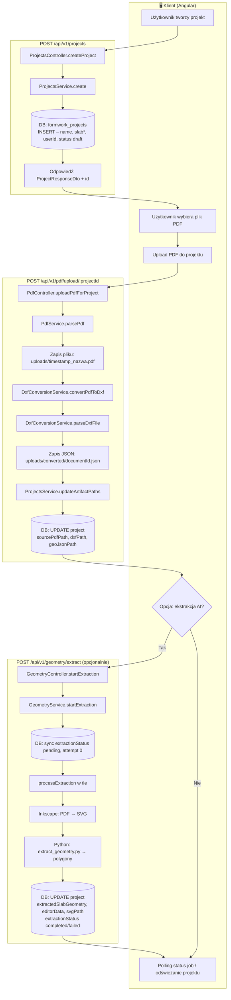
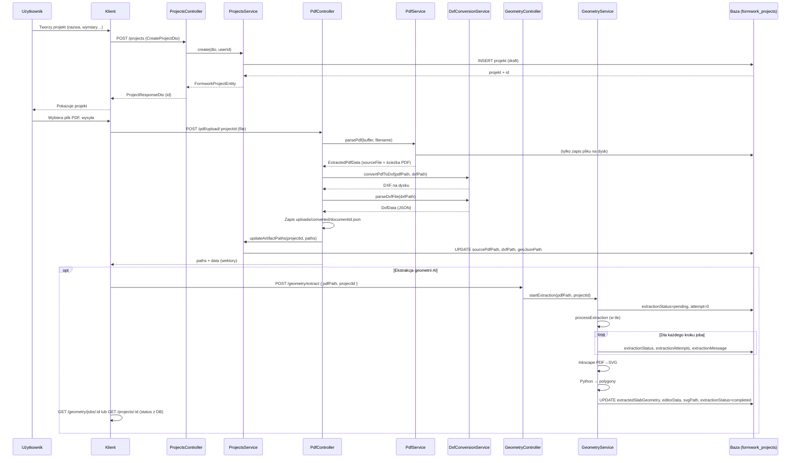

# Flow: utworzenie projektu i upload PDF

Schemat blokowy od utworzenia projektu przez upload PDF do konwersji wektorów i (opcjonalnie) ekstrakcji geometrii AI.

---

## Schemat blokowy (Mermaid)

---

## Uproszczony schemat sekwencji

---

## Gdzie co jest zapisywane w bazie

| Etap | Endpoint / akcja | Kolumny w `formwork_projects` |
|------|-------------------|--------------------------------|
| **1. Utworzenie projektu** | POST /projects | id, name, description, slabLength, slabWidth, slabThickness, floorHeight, slabType, formworkSystem, userId, status=draft, createdAt, updatedAt |
| **2. Upload PDF** | POST /pdf/upload/:projectId | **sourcePdfPath** (ścieżka do PDF), **dxfPath** (ścieżka do DXF), **geoJsonPath** (ścieżka do JSON wektorów) |
| **3. Ekstrakcja geometrii** | POST /geometry/extract | **extractionStatus**, **extractionAttempts**, **extractionMessage** (w trakcie), potem **extractedSlabGeometry**, **editorData**, **svgPath** oraz extractionStatus=completed/failed |

Pliki na dysku (po uploadzie):

- `uploads/<timestamp>_nazwa.pdf` – oryginalny PDF  
- `uploads/<documentId>.dxf` – DXF (documentId = nazwa pliku PDF bez rozszerzenia)  
- `uploads/converted/<documentId>.json` – GeoJSON wektorów (podkład w edytorze)

Po ekstrakcji AI (opcjonalnie):

- `uploads/converted/<projectId>.svg` – SVG z Inkscape (geometria AI)

---

## Tabela `processing_jobs` (stany jobów)

Stany jobów przetwarzania (ekstrakcja geometrii itd.) są trzymane w **tabeli `processing_jobs`**, a nie tylko w pamięci. Dzięki temu:

- **GET /api/v1/geometry/jobs/:id** odczytuje stan z bazy (persystencja między restartami).
- **Korelacja z projektem**: kolumna `projectId` (FK do `formwork_projects`) – każdy job może być powiązany z projektem.
- **Przygotowanie pod Redis/kolejkę**: tabela jest źródłem prawdy; później można dodać synchronizację z Redis lub kolejką (np. Bull).

Kolumny: `id` (UUID), `type` (np. `geometry_extraction`), `status`, `message`, `attempt`, `projectId`, `payload` (JSON), `result` (JSON), `error`, `createdAt`, `updatedAt`. Encja: `optimizer/src/inventory/entities/processing-job.entity.ts`.

---

## Testy E2E API (pełny flow)

Plik **`optimizer/test/project-upload-pdf-flow.e2e-spec.ts`** zawiera testy E2E API przechodzące przez cały schemat:

1. **POST /api/v1/projects** – utworzenie projektu (draft, bez ścieżek).
2. **GET /api/v1/projects/:id** – odczyt projektu.
3. **POST /api/v1/pdf/upload/:projectId** – upload PDF (mock DXF/parsePdf), odpowiedź ze ścieżkami.
4. **GET /api/v1/projects/:id** – weryfikacja ścieżek (lub po retry-artifacts).
5. **POST /api/v1/geometry/extract** – start ekstrakcji, zwrot jobId.
6. **GET /api/v1/geometry/jobs/:id** – status joba.
7. **GET /api/v1/projects/:id** – extractionStatus w DB.
8. **GET /api/v1/projects** – lista z polami ekstrakcji.
9. **POST /api/v1/projects/:id/retry-artifacts** – ponowne generowanie artefaktów.
10. **Pełna ścieżka w jednym teście** – rejestracja → login → projekt → upload → GET → ekstrakcja → polling job → GET projekt.

Uruchomienie: `npm run test:e2e -- project-upload-pdf-flow` (w katalogu `optimizer`).

---

## Testy E2E: Polling, retry, wektory (100% ścieżek)

Plik **`optimizer/test/polling-retry-vectors.e2e-spec.ts`** weryfikuje:

- **A. Polling job** – GET `/api/v1/geometry/jobs/:id`: 404 dla nieistniejącego; od razu po POST status pending/processing; **poll do completed/failed** (max 25s).
- **B. Polling project** – GET `/api/v1/projects/:id`: `extractionStatus` po starcie ekstrakcji; **poll do extractionStatus completed/failed** (max 25s).
- **C. Retry-artifacts** – 400 gdy brak `sourcePdfPath`; 200 gdy brak artefaktów + GET ma `dxfPath`/`geoJsonPath`; 200 gdy artefakty już są; 404 dla nieistniejącego projektu; **ponowny poll GET project** – spójność danych.
- **D. Wektory** – GET `/api/v1/floor-plans-dxf/:documentId`: 400 dla nieistniejącego `documentId`; 200 z `entities`, `layers`, `bounds` gdy `documentId` z `geoJsonPath` projektu.
- **E. Pełny flow** – upload → opcjonalny retry → **poll GET project** aż `geoJsonPath` → GET wektorów; oraz extract → **poll job** do completed/failed → GET project → wektory gdy jest `geoJsonPath`.

Uruchomienie: `npm run test:e2e -- polling-retry-vectors` (w katalogu `optimizer`).

---

## Analiza pokrycia testów E2E vs schemat

### Co jest przetestowane

| Scenariusz / endpoint | Gdzie | Uwagi |
|------------------------|-------|--------|
| POST /projects | flow, polling | 201, id, status draft |
| GET /projects/:id | flow, polling | 200, pola projektu |
| POST /pdf/upload/:projectId (z plikiem) | flow, polling | 201, paths.pdf/dxf/json |
| POST /pdf/upload bez pliku | flow | 400 |
| GET /projects (lista) | flow | data, meta, projekt w liście |
| POST /geometry/extract (pdfPath + projectId) | flow, polling | 201, jobId |
| GET /geometry/jobs/:id (istniejący) | flow, polling | 200, status, message |
| GET /geometry/jobs/:id (nieistniejący) | polling | 404 |
| Polling job do completed/failed | flow, polling | A3, pełny flow |
| GET /projects/:id – extractionStatus | flow, polling | po starcie i po zakończeniu |
| **Spójność job ↔ projekt (extractionStatus = status)** | polling | **B3** – w każdej iteracji |
| POST /projects/:id/retry-artifacts (200, 400, 404) | flow, polling | C1–C5 |
| GET /floor-plans-dxf/:documentId (200, 400) | polling | D1, D2, E |
| Pełna ścieżka: rejestracja → projekt → upload → extract → poll | flow, polling | describe 6, E1, E2 |

### Scenariusze uzupełnione (luki zamknięte)

- **POST /geometry/extract** – walidacja: brak `pdfPath` lub pusty body → **400**.
- **Ekstrakcja z nieistniejącym PDF** – `pdfPath` wskazuje na brakujący plik → job w stanie **failed**, message „PDF file not found”; poll GET job to weryfikuje.
- **GET /projects/:id/editor-data** – po zakończonej ekstrakcji (completed) → **200**, odpowiedź zawiera strukturę edytora (tabs/layers) lub null.
- **POST /pdf/upload/:projectId** bez tokena → **401**.
- **GET /projects/:id** z nieistniejącym UUID → **404**.

### Scenariusze poza obecnym zakresem (opcjonalnie)

- GET /floor-plans-dxf/:documentId/**raw** – zwraca surowy DXF; osobny endpoint, nie w głównym flow.
- PUT /projects/:id/editor-data – zapis danych edytora; integracja z edytorem, nie z flow PDF→ekstrakcja.
- POST /projects/:id/calculate, optimization – osobne flow obliczeń.
- Szczegółowa walidacja DTO tworzenia projektu (400) – w `projects.e2e-spec.ts`.
